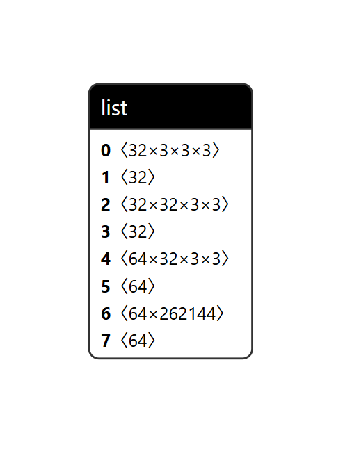
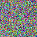
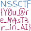

# README

经典的DLG攻击。task文件夹下是本题的题目，已知的是训练代码和模型pkl文件，但缺少的是CNN的Net文件。所以我们要通过模型泄露的信息来恢复这个神经网络

```
import torch
from PIL import Image
from module import LogoNet
import torchvision.transforms as transforms
import torch.nn.functional as F
import pickle
import time

def label_to_onehot(target):
    target = torch.unsqueeze(target, 1)
    onehot_target = torch.zeros(target.size(0), 64, device=target.device)
    onehot_target.scatter_(1, target, 1)
    return onehot_target

def cross_entropy_for_onehot(pred, target):
    return torch.mean(torch.sum(- target * F.log_softmax(pred, dim=-1), 1))

def weights_init(m):
    if hasattr(m, "weight"):
        m.weight.data.uniform_(-0.5, 0.5)
    if hasattr(m, "bias"):
        m.bias.data.uniform_(-0.5, 0.5)

if __name__ == "__main__":
    device = "cpu"
    criterion = cross_entropy_for_onehot
    tt = transforms.Compose([
        transforms.Resize((64, 64)),
        transforms.ToTensor()
    ])
    tp = transforms.ToPILImage()
    seed = int(time.time()) // 100000
    torch.manual_seed(seed)
    model = LogoNet()
    model.to(device)
    model.apply(weights_init)
    img = Image.open(f'data/logo.png').convert('RGB')
    img_tensor = tt(img)
    gt_label = torch.Tensor([int(0)]).long().to(device)
    gt_label = gt_label.view(1, )
    gt_onehot_label = label_to_onehot(gt_label)
    out = model(img_tensor)
    y = criterion(out, gt_onehot_label)
    dy_dx = torch.autograd.grad(y, model.parameters())
    original_dy_dx = list((_.detach().clone() for _ in dy_dx))
    with open(f'model/logo.pkl', 'wb') as f:
        pickle.dump(original_dy_dx, f)
        
```

恢复Net需要进行pkl反序列化操作

```
import pickle

with open("./task/model/logo.pkl", "rb") as f:
    param_shapes = pickle.load(f)

for item in param_shapes:
    if isinstance(item, (list, tuple)) and len(item) == 2:
        name, shape = item
        print(f"Parameter {name}: Shape = {shape}")
    else:
        print("Unexpected item format:", item)
```

或者在Netron



这里泄露的只有卷积层和全连接层的张量，中间的激活函数需要猜测，我们看哪种激活函数能够显著使得Loss降低

按照DLG攻击原理我们需要先生成一张噪声图片

```
from PIL import Image
import numpy as np

# 生成 64x64 随机噪声
noise = (np.random.rand(64, 64, 3) * 255).astype(np.uint8)
img = Image.fromarray(noise)

# 保存为 noise.png
file_path = "noise.png"
img.save(file_path)

```




接着用[mit-han-lab/dlg: [NeurIPS 2019\] Deep Leakage From Gradients](https://github.com/mit-han-lab/dlg/)的脚本恢复

```
import torch
from PIL import Image
import torchvision.transforms as transforms
import torch.nn as nn
import torch.nn.functional as F
import pickle
import torch.nn as nn
class LogoNet(nn.Module):
    def __init__(self):
        super().__init__()
        self.conv_layers = nn.Sequential(nn.Conv2d(3, 32, kernel_size=3, padding=1),
        nn.Sigmoid(),
        # 第⼆卷积块
        nn.Conv2d(32, 32, kernel_size=3, padding=1),
        nn.Sigmoid(),
    # 第三卷积块
        nn.Conv2d(32, 64, kernel_size=3, padding=1),
        nn.Sigmoid())
        self.fc = nn.Linear(262144, 64) # 输⼊维度由卷积输出计算得出
    def forward(self, x):
        x = self.conv_layers(x)
        x = x.view(x.size(0), -1) # 展平操作
        x = self.fc(x)
        return x
def label_to_onehot(target):
    target = torch.unsqueeze(target, 1)
    onehot_target = torch.zeros(target.size(0), 64, device=target.device)
    onehot_target.scatter_(1, target, 1)
    return onehot_target

def cross_entropy_for_onehot(pred, target):
    return torch.mean(torch.sum(-target * F.log_softmax(pred, dim=-1), 1))

def weights_init(m):
    if hasattr(m, "weight"):
        m.weight.data.uniform_(-0.5, 0.5)
    if hasattr(m, "bias"):
        m.bias.data.uniform_(-0.5, 0.5)

for i in range(1):
    with open(f'./task/model/logo.pkl', 'rb') as f:
        original_dy_dx = pickle.load(f)
        device = 'cpu'
    torch.manual_seed(17402)
    model = LogoNet()
    model.to(device)
    model.apply(weights_init)
    tt = transforms.Compose([transforms.Resize((64, 64)),transforms.ToTensor()
     ])
    tp = transforms.ToPILImage()
    gt_data = tt(Image.open(f'noise.png')).float().to(device)
    gt_data = gt_data.view(1, *gt_data.size())
    gt_label = torch.Tensor([1]).long().to(device)
    gt_label = gt_label.view(1, )
    gt_onehot_label = label_to_onehot(gt_label)
    dummy_data = torch.randn(gt_data.size()).to(device).requires_grad_(True)
    dummy_label = torch.randn(gt_onehot_label.size()).to(device).requires_grad_(True)
    criterion = cross_entropy_for_onehot
    optimizer = torch.optim.LBFGS([dummy_data, dummy_label])
    history = []
    for iters in range(100):
        def closure():
            optimizer.zero_grad()

            dummy_pred = model(dummy_data)
            dummy_onehot_label = F.softmax(dummy_label, dim=-1)
            dummy_loss = criterion(dummy_pred, dummy_onehot_label)
            dummy_dy_dx = torch.autograd.grad(dummy_loss, model.parameters(), 
            create_graph=True)
            grad_diff = 0
            for gx, gy in zip(dummy_dy_dx, original_dy_dx):
                grad_diff += ((gx - gy) ** 2).sum()
            grad_diff.backward()
            return grad_diff
        optimizer.step(closure)
        if iters % 10 == 0:
            current_loss = closure()
            print(iters, "%.4f" % current_loss.item())
            history.append(tp(dummy_data[0].cpu()))
    history[-1].save(f'logo.png')
    
```

